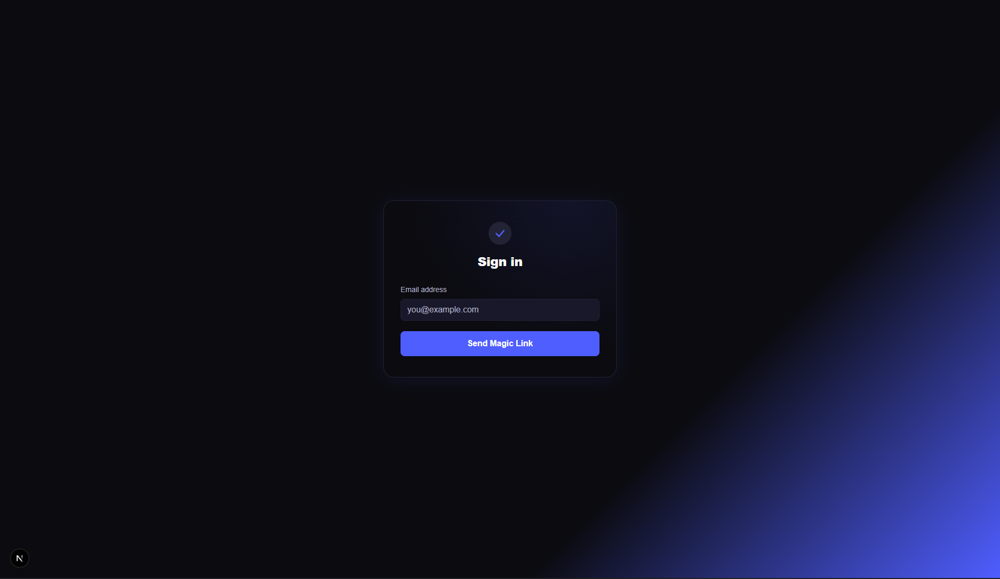
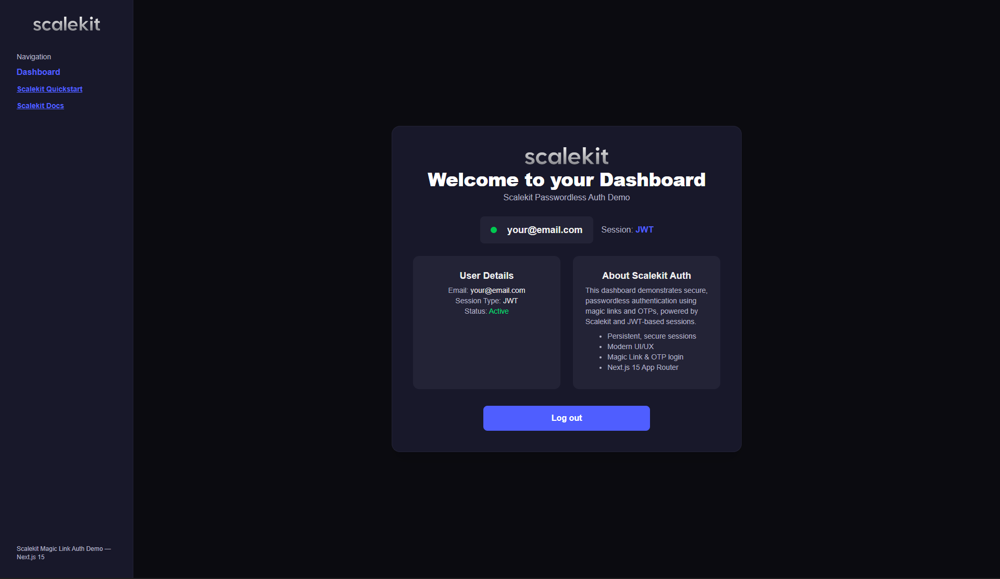

# Next.js Passwordless Auth with Scalekit

This project demonstrates a production-ready passwordless authentication flow using Next.js 15 (App Router) and [Scalekit](https://scalekit.com) for sending magic links or OTPs to users' email addresses.

## 🏗️ Architecture & Flow

## 📸 Screenshots

Below are screenshots of the main flows:

### Sign-In Screen


### OTP Screen


### Dashboard


### Magic Link Mail


**Frontend:**

- Built with Next.js App Router and React.
- Users enter their email, receive a magic link or OTP, and verify their identity.
- No dashboard or session-persisted UI is included (demo stops at login success).

**Backend/API:**

- Next.js API routes under `/api/auth/` handle sending and verifying passwordless codes.
- Uses Scalekit Node SDK to send emails and verify codes/magic links.
- Session logic is removed for simplicity; see Scalekit docs for production session management.

**Flow:**

1. User enters email and submits.
2. `/api/auth/send-passwordless` sends a magic link/OTP to the email using Scalekit.
3. User enters OTP (or clicks magic link).
4. `/api/auth/verify-otp` verifies the code; on success, UI shows "Login successful!".

## 🛠️ Tech Stack & Libraries

- [Next.js](https://nextjs.org/) (App Router)
- [React](https://react.dev/)
- [Scalekit Node SDK](https://www.npmjs.com/package/@scalekit-sdk/node)
- [Tailwind CSS](https://tailwindcss.com/) for styling

## 🚀 Getting Started

1. **Clone the repo:**

 ```bash
 git clone <repo-url>
 cd nextjs-passwordless-auth
 ```

2. **Install dependencies:**

 ```bash
 npm install
 # or yarn or pnpm
 ```

3. **Configure environment variables:**

- Copy `.env.example` to `.env.local` and fill in your Scalekit credentials:

   ```env
   SCALEKIT_ENVIRONMENT_URL=...
   SCALEKIT_CLIENT_ID=...
   SCALEKIT_CLIENT_SECRET=...
   NEXT_PUBLIC_BASE_URL=http://localhost:3000
   ```

4. **Run the dev server:**

 ```bash
 npm run dev
 ```

5. **Open the app:**

- Visit [http://localhost:3000](http://localhost:3000)

## 📝 How It Works

1. **Email Submission:**

- User enters their email and submits the form.
- The frontend calls `/api/auth/send-passwordless`.
- The API route uses Scalekit to send a magic link or OTP to the email.

2. **OTP Verification:**

- User enters the OTP received in their email.
- The frontend calls `/api/auth/verify-otp`.
- The API route verifies the OTP with Scalekit.
- On success, the UI shows a success message.

3. **Magic Link Verification:**

- If the user clicks the magic link, `/api/verify-magic-link` is called.
- The API route verifies the link token with Scalekit.
- (Session logic is omitted in this demo.)

## 📦 File Structure

```
src/
├── app/
│   ├── page.tsx                  # Main login UI
│   ├── dashboard/
│   │   └── page.tsx              # Dashboard page
│   ├── verify-magic-link/
│   │   └── page.tsx              # Magic link verification UI (client page)
│   ├── api/
│   │   └── auth/                 # Auth API namespace
│   │       ├── send-passwordless/ # Send magic link / OTP
│   │       │   └── route.ts
│   │       ├── verify-otp/       # Verify OTP code
│   │       │   └── route.ts
│   │       ├── verify-magic-link/ # Verify magic link token (GET & POST)
│   │       │   └── route.ts
│   │       ├── logout/           # Destroy session
│   │       │   └── route.ts
│   │       └── session/          # Session introspection
│   │           └── route.ts
│   ├── globals.css               # Global styles
│   ├── layout.tsx                # Root layout
│   └── favicon.ico               # Favicon
├── lib/
│   └── session-store.ts          # In-memory session store (demo only)
public/
├── sign-in.png                   # Screenshot: Sign-In
├── otp.png                       # Screenshot: OTP
├── dashboard.png                 # Screenshot: Dashboard
├── magil-link-mail.png           # Screenshot: Magic Link Mail
├── scalekit.png                  # Scalekit logo
└── ...                           # Other public assets
```

## 📚 References

- [Scalekit Quickstart](https://docs.scalekit.com/passwordless/quickstart/)
- [Scalekit Docs](https://docs.scalekit.com/)
- [Next.js Docs](https://nextjs.org/docs)
- [Tailwind CSS Docs](https://tailwindcss.com/docs)
