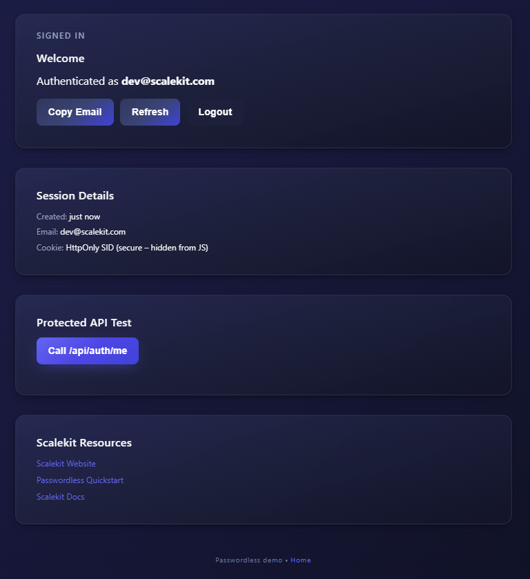
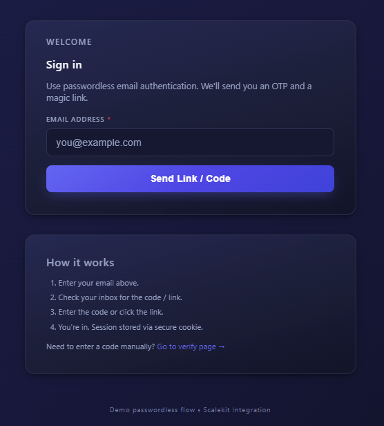
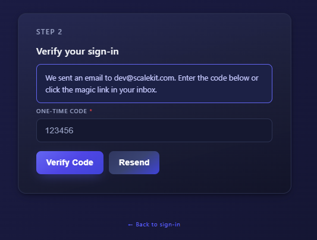

# Solid Passwordless Auth (Scalekit)

Minimal SolidStart demo: [passwordless](https://docs.scalekit.com/passwordless/quickstart/) email auth (OTP + Magic Link) using [Scalekit](http://scalekit.com/). Focus: clarity, few files, quick start.



## Quick Start

1. Install deps:

```sh
npm install
```

1. Create `.env`:

```ini
SCALEKIT_ENV_URL=YOUR_ENV_URL
SCALEKIT_CLIENT_ID=YOUR_CLIENT_ID
SCALEKIT_CLIENT_SECRET=YOUR_CLIENT_SECRET
SESSION_SECRET=dev_secret_change
APP_BASE_URL=http://localhost:3000
```

1. In Scalekit set Magic Link redirect to `${APP_BASE_URL}/passwordless/verify`.

1. Run:

```sh
npm run dev
```

1. Visit: <http://localhost:3000>

## How It Works

1. User enters email (store `authRequestId`).



2. Email delivers OTP + magic link.



3. User enters code or clicks link -> `/api/auth/verify` sets session cookie.
4. Dashboard loads (server guard + client context).
5. Optional resend uses same `authRequestId`.

## Key Files (skim these first)

`src/context/AuthContext.tsx` auth state (user + pendingEmail + authRequestId, TTL + SWR refresh, logout, force refresh).
`src/routes/api/auth/*.ts` send / resend / verify / me / logout endpoints (unified JSON).
`src/routes/index.tsx` email form (OTP + link start).
`src/routes/passwordless/verify.tsx` OTP entry + magic link finalize.
`src/routes/dashboard.tsx` protected page (server redirect + client guard).
`src/scalekit.ts` Scalekit singleton.  `src/session.ts` cookie session.
UI: `components/ui/*` primitives; `AuthFormBoundary` localized error fallback.

## Design Choices

State: Solid signals instead of Pinia (simpler, no extra dep).
Protection: Server redirect on dashboard + `<Protected>` client check.
Responses: `{ success, data?, error? }` everywhere.
Caching: 10s TTL + debounce + background SWR refresh; force refresh button.
Accessibility: aria-live Alerts, minimal focus friction.

## Security (Add Before Production)

- CSRF protection (POST endpoints)
- Persistent rate limiting (Redis) instead of in-memory
- Secure cookie with HTTPS (auto when NODE_ENV=production)
- User persistence (DB) and audit logging

## Rate Limiting

This project uses a simple in-memory rate limiter to prevent abuse and brute-force attacks. It tracks requests per user/session in server memory and blocks requests that exceed a defined limit within a time window.

### Why In-Memory?

- Fast and easy: No external dependencies or setup required.
- Good for demos, small apps, or single-server deployments.

### Limitations

- Not suitable for multi-server or distributed environments (no shared state).
- Data is lost if the server restarts.
- For production or scalable systems, use a distributed store (e.g., Redis) for rate limiting.

For a deeper dive into passwordless authentication with SolidJS, see the Scalekit blog: [Passwordless Authentication in SolidJS](https://www.scalekit.com/blog/passwordless-authentication-solid-js)
